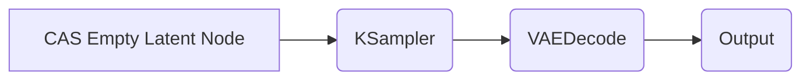

# 📐 CASNodes: Aspect Ratio Presets for ComfyUI

Unlock precision and convenience when generating empty latents for your favourite models in ComfyUI!
CASNodes lets you select popular **aspect ratio** and **resolution** presets—optimized for **Stable Diffusion 1.5, Stable Diffusion XL, Flux, Chroma, and HiDream**—or define your own by axis and ratio.

---


---

## ✨ Features

* **Instant Dropdown Selection:**
  Choose from a wide range of common image aspect ratios and sizes.
* **Supports Leading Models:**
  Fully compatible with SD 1.5, SDXL, Flux, Chroma, and HiDream.
* **Two Node Modes:**

  * **From Preset:** Pick from curated model/ratio presets.
  * **By Axis:** Enter one dimension, pick aspect ratio, and auto-calculate the other.
* **Clean ComfyUI Integration:**
  Appears under the standard `latent` category—no clutter, pure utility.

---

## 📦 Installation

### 1. With **ComfyUI Custom Node Manager** (Recommended)

* Open ComfyUI
* Go to **Custom Node Manager**
* Search for `comfyui-aspect-ratio-presets`
* Click **Install**

### 2. Manual (GitHub)

```bash
cd YOUR_COMFYUI/custom_nodes
git clone https://github.com/budihartono/comfyui-aspect-ratio-presets.git
```

* Restart ComfyUI

---

## 🛠️ Usage

1. **Find your new nodes** under the `latent` group:

   * **CAS Empty Latent Aspect Ratio from Preset**
   * **CAS Empty Latent Aspect Ratio by Axis**

2. **Preset Mode:**
   Select a resolution and aspect ratio like:

   * `1024x1024 1:1 Square - SDXL`
   * `912x512 16:9 Landscape - SD15`
   * `1216x832 3:2 Landscape - Flux`

   *The output is a ready-to-use empty latent tensor, correctly sized for your model.*

3. **By Axis Mode:**

   * Enter a width or height.
   * Pick your aspect ratio (e.g., `3:2 Landscape`).
   * The node calculates the matching dimension.

---

## 💡 Typical Workflow



1. **Add a CASNodes latent node**
2. Connect it to **KSampler** (or any node needing a latent)
3. Decode and save as usual!

---

## 📚 Supported Aspect Ratios & Models

* All presets are tailored for leading models:

  * **Stable Diffusion 1.5**
  * **Stable Diffusion XL**
  * **Flux**
  * **Chroma**
  * **HiDream**
* You can add your own in `presets.py`!

---

## 📝 Credits

Developed by [@budihartono](https://github.com/budihartono)

Open source for the benefit of the community.
Contributions are welcome, but please note: this project is provided as-is, and active support or responses to issues/pull requests may be limited or unavailable.

---

Enjoy supercharged workflows, perfectly matched to your favourite diffusion models!

---
